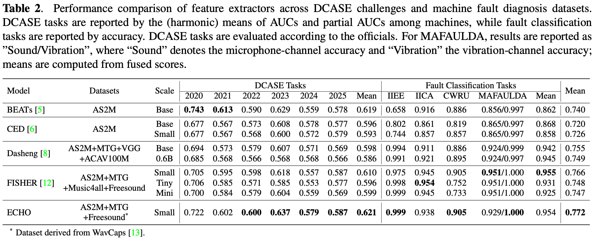

# ECHO

**frEquenCy-aware Hierarchical encOding for variable-length signal**

[](LICENSE)
[](https://huggingface.co/yucongzh/echo-small-0824)
[](https://huggingface.co/papers/2508.14689)
[](https://arxiv.org/abs/2508.14689)
[](https://zenodo.org/records/16935787)

ECHO is a state-of-the-art general signal representation learning model based on Masked Autoencoders (MAE) with band-splitting and frequency position encoding.

## Performance

Overall performance summary on [SIREN](https://github.com/yucongzh/SIREN) benchmark (DCASE anomaly detection + Fault classification):




## Features

- **Band-splitting architecture**: Processes audio in frequency bands for better local and global representation learning
- **Frequency position encoding**: Incorporates frequency information into the model for better audio understanding
- **Efficient patch embedding**: Uses sliding window patches for temporal modeling, enabling varying time lengths

## Installation

```bash
pip install -r requirements.txt
```

## Pre-trained Models

| Model | Embed Dim | Layers | Heads | Parameters | Download |
|-------|-----------|--------|-------|------------|----------|
| ECHO-Small | 384 | 12 | 6 | ~21.5M | [Hugging Face](https://huggingface.co/yucongzh/echo-small-0824) · [Zenodo](https://zenodo.org/records/16935787) |
| ECHO-Base | - | - | - | - | Coming Soon |
| ECHO-Mini | - | - | - | - | Coming Soon |
| ECHO-Tiny | - | - | - | - | Coming Soon |

## Model Architecture

The ECHO model consists of:
- **Patch Embedding**: Converts spectrogram bands to patch embeddings
- **Transformer Encoder**: Multi-layer transformer for feature learning
- **Frequency Position Encoding**: Adds frequency-aware positional information
- **Band Processing**: Splits audio into frequency bands for hierarchical learning

## Usage

### Model Import

```python
# Download from Huggingface (recommended)
from huggingface_hub import snapshot_download

# Download the model to local directory
model_path = snapshot_download(
    repo_id="yucongzh/echo-small-0824",
    local_dir="./echo-small",
    local_dir_use_symlinks=False
)
print(f"Model downloaded to: {model_path}")

import torch
import torchaudio
import sys

# Add the model path to downloaded HF model path
sys.path.append('./echo-small')

# Import the model architecture
from audioMAE_band_upgrade import AudioMAEWithBand

# Create model instance with your configuration
model = AudioMAEWithBand(
    spec_len=2000,
    band_width=32,
    shift_size=16,
    in_chans=1,
    embed_dim=384,
    encoder_depth=12,
    num_heads=6,
    mlp_ratio=4.0,
    freq_pos_emb_dim=384
)

# Load pre-trained weights
from safetensors.torch import load_file
state_dict = load_file('model.safetensors')
model.load_state_dict(state_dict, strict=False)

---

# Clone this repository and download checkpoint (*.pth) from other sources (eg. Zenodo)
model_path = "/path/to/checkpoint.pth"
checkpoint = torch.load(model_path, map_location='cuda')

# Create model instance with your configuration
model_cfg = {
    "spec_len": 2000,
    "shift_size": 16,
    "in_chans": 1,
    "embed_dim": 384,
    "encoder_depth": 12,
    "num_heads": 6,
    "mlp_ratio": 4.0,
    "norm_layer": lambda x: torch.nn.LayerNorm(x, eps=1e-6),
    "fix_pos_emb": True,
    "band_width": self.band_width,
    "mask_ratio": 0.75,
    "freq_pos_emb_dim": 384,
}
model = AudioMAEWithBand(**model_cfg)

# Load pre-trained weights
model.load_state_dict(checkpoint['encoder']) 
```

### Feature Extraction
```python
# Set to evaluation mode
model.eval()

# Example usage
audio_signal = torch.randn(1, 80000)  # 5 seconds at 16kHz
sample_rate = 16000

# Method 1: Extract features directly from audio (Recommended)
with torch.inference_mode():
    utterance_level_features, segment_level_features = model.extract_features_from_audio(audio_signal, sample_rate=sample_rate)
print(f"Utterance-level Feature shape: {utterance_level_features.shape}")  # Should be [2688,]
print(f"Segment-level Feature shape: {segment_level_features.shape}")  # Should be [32,2688]

# Method 2: Use preprocessing separately, then extract features
spec = model.preprocess_audio_to_spectrogram(audio_signal, sample_rate=16000)
print(f"Spectrogram shape: {spec.shape}")

# Extract features from preprocessed spectrogram
with torch.inference_mode():
    utterance_level_features, segment_level_features = model.extract_features(spec, sample_rate=sample_rate)
print(f"Utterance-level Feature shape: {utterance_level_features.shape}")  # Should be [2688,]
print(f"Segment-level Feature shape: {segment_level_features.shape}")  # Should be [32,2688]
```


## Citation
```bibtex
@article{echo2025,
  title={ECHO: Frequency-aware Hierarchical Encoding for Variable-length Signal},
  author={Yucong Zhang and Juan Liu and Ming Li},
  journal={arXiv preprint arXiv:2508.14689},
  year={2025},
}
```

## License

This project is licensed under the MIT License. See the [LICENSE](LICENSE) file for details.


## Acknowledgments

We gratefully acknowledge the following open-source projects for inspiration and foundations:

- **AudioMAE**: Masked Autoencoders that Listen. [GitHub](https://github.com/facebookresearch/AudioMAE/tree/bd60e29651285f80d32a6405082835ad26e6f19f)
- **FISHER**: A foundation model for industrial signal comprehensive representation. [GitHub](https://github.com/jianganbai/FISHER)
- **EAT**: Self-Supervised Pre-Training with Efficient Audio Transformer. [GitHub](https://github.com/cwx-worst-one/EAT)

